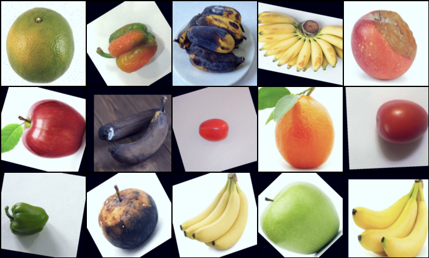
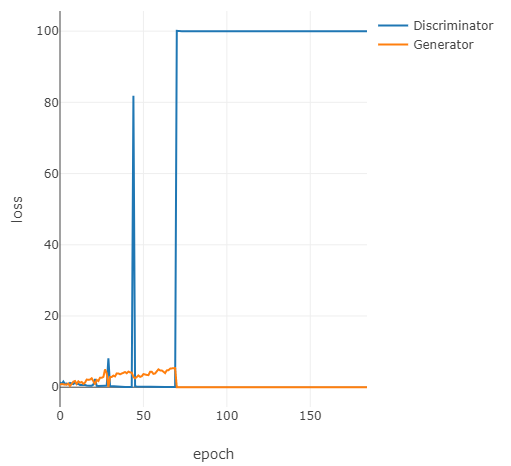
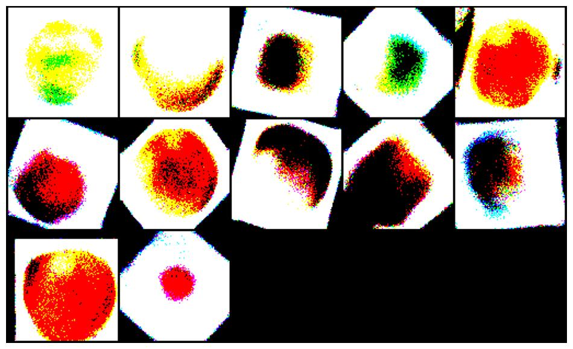

## <centner>Freshness recognition of fruit and vegetable images using GANs Series data augmentation<center>

The use of computer vision techniques to distinguish fresh from stale fruit has gained widespread acceptance in recent years. However, the scarcity of datasets in this field has made it more difficult for many of the research results to be accessible in real-life situations. The core idea of this paper is to improve the generalization of the training set and the performance of the classifier by augmenting the fruit and vegetable image dataset with neural networks. This paper will investigate the applicability of the established Conditional Generative Adversarial Nets (CGAN) in this domain and discover problems such as pattern recognition. The contribution of this paper is to combine existing structures and propose novel adversarial generative networks for the fruit and vegetable image, including Conditional Wasserstein GAN with Gradient Penalty (CWGAN-GP) and Auxiliary Classifier Wasserstein GAN with Gradient Penalty (ACWGAN-GP). In addition, a pre-trained models with Spinal fully-connected layer and ProgressiveSpinal fully-connected layer was used to freshness classify. It was found that ACWGAN-GP, which combines multiple network structures, not only produced more realistic and diverse images in the fruit and vegetable domain, but also maintained the learning speed of a single model during the training. In addition, by adding synthetic images to the training, the fruit and vegetable freshness classifier achieves 100% accuracy on a specified validation set.

Paper link:

### Dataset

As mentioned above, datasets on the freshness of Fruit and Vegetable are really scarce. At the beginning of the experiment, I just find only one suitable dataset [here](https://www.kaggle.com/datasets/raghavrpotdar/fresh-and-stale-images-of-fruits-and-vegetables). Let's see some samples below.




### Results

During the my research, only 5 models had been used, including CGAN, CWGAN-GP, ACWGAN-GP, SpinalNet and ProgressiveSpinalNet. For the GANs series models, some summarized results are shown below. 

#### CGAN

Unfortunately, CGAN, as my first model to try, encountered issues with the Mode Collapse. And the output of Generator revolves around the feature of fresh or stale apple(round and no bars).



#### CWGAN-GP

For the second Generative model, there is no doubt that something is improving. The model can learn the feature of bar fruit and stale fruit, like stale banana. However, as the main layer of this model is Full-Connected layer, the output image is not realisitc. 



#### ACWGAN-GP

Replacing the main layer with convolutional layer and adding the architecture of ACGAN, the output images from Generator is realistic and diverse. 

Below is the output images from epoch 1 to epoch 100000(compressed, fps=0.1).


### Requirements

Throughout the entire experiment, I run the code with PyTorch 1.11.0(Cuda 11.3) and  Python 3.8(ubuntu20.04). For visualizing the output from first model(CGAN) Generator, you will need the facebook's **[visdom](https://github.com/facebookresearch/visdom)** library.

### Running the models

For the first running, you should download the [dataset](https://www.kaggle.com/datasets/raghavrpotdar/fresh-and-stale-images-of-fruits-and-vegetables) to the parent directory of the all models "train.py". 

Then, you need to set all compulsory arguments that suitable your machine, like *“batch_size”* etc. Below is an example for running ACWGAN-GP model:

```python
python train.py --train_dir /path/to/train --validation_dir /path/to/validation/ --output_path /path/to/output/ --dim 64 --saving_step 100 --num_workers 12
```

### Acknowledgements

- [Improved Training of Wasserstein GANs in Pytorch](https://github.com/jalola/improved-wgan-pytorch)
- [Conditional-WGAN-GP](https://github.com/u7javed/Conditional-WGAN-GP)
- [Generative adversarial networks using Pytorch](https://github.com/ozanciga/gans-with-pytorch)

